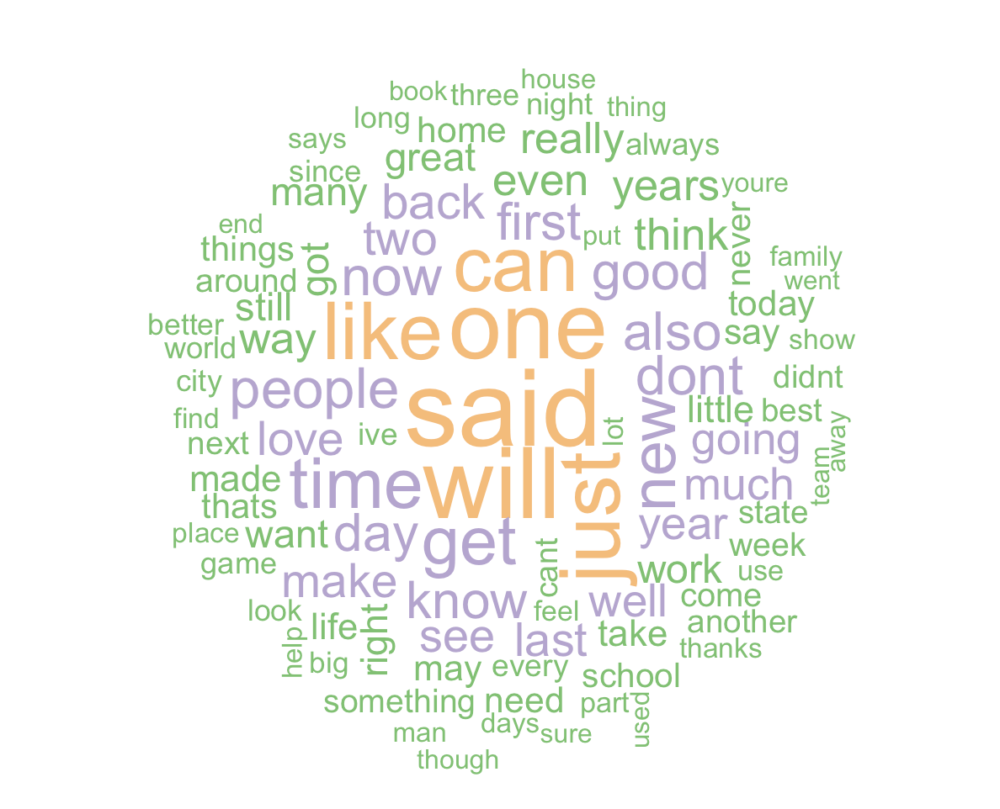
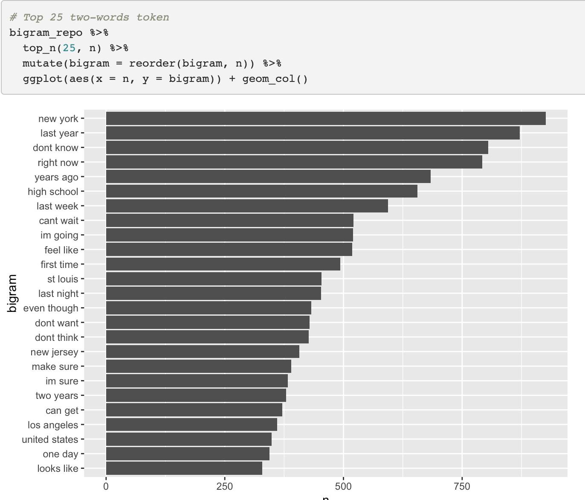
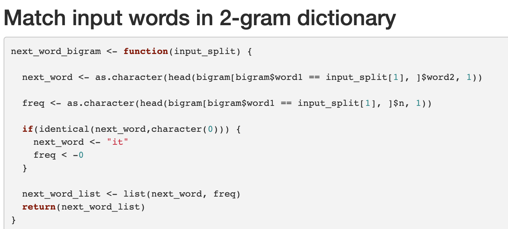
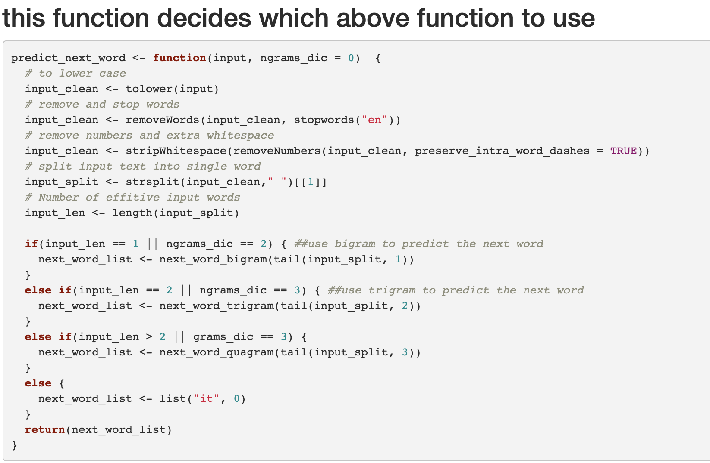
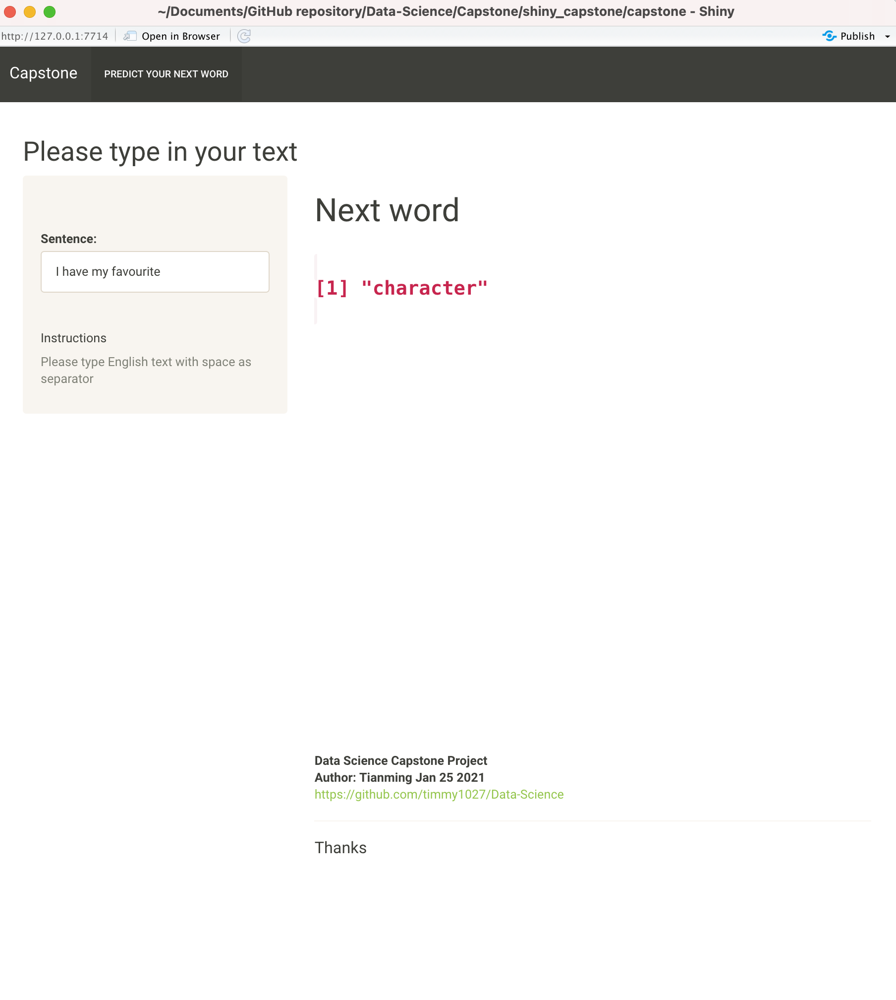

```{r setup, include=FALSE}
knitr::opts_chunk$set(echo = TRUE)
```

## Data loading and cleaning
```{r echo = FALSE, out.width= "100%"}

```

## Tokenize the text using ngrams
### This is an example of 2-gram words
```{r echo = FALSE, out.width= "100%"}

```

## Function to predict next word
```{r echo = FALSE, out.width= "60%"}


```


## Shiny App product to predict the next word
```{r echo = FALSE, out.width= "100%"}

```